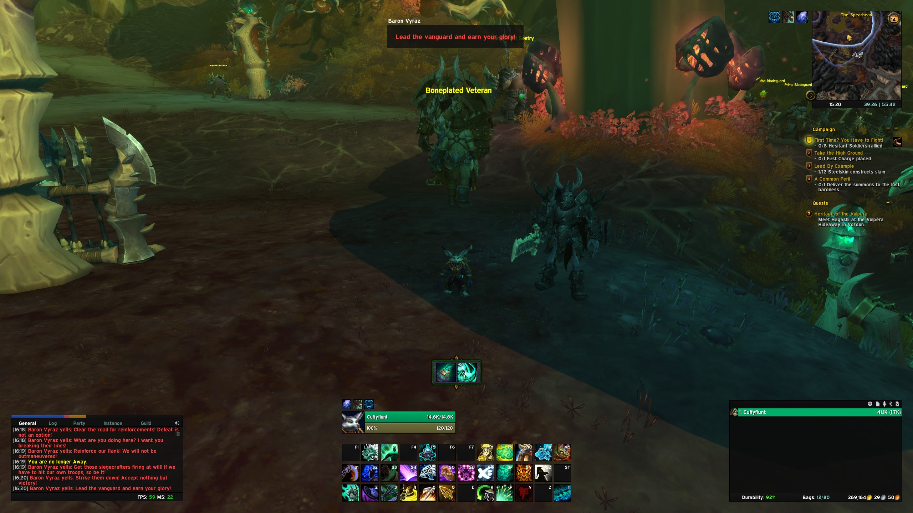
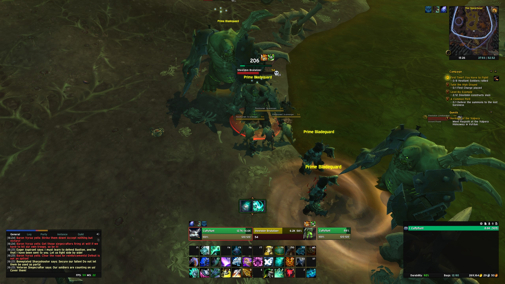
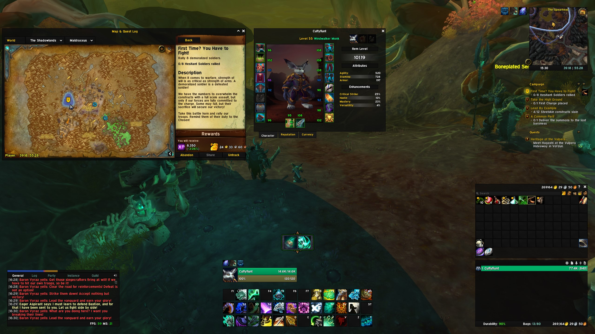
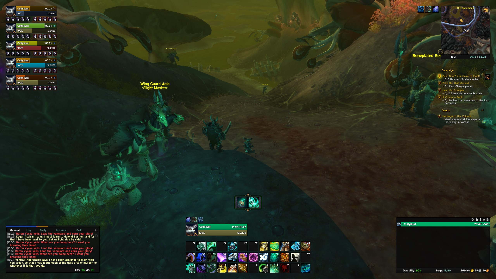
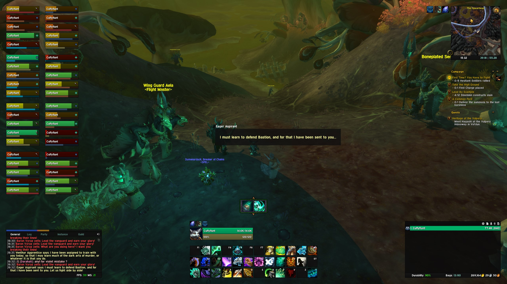
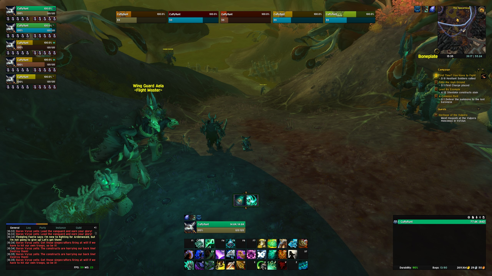
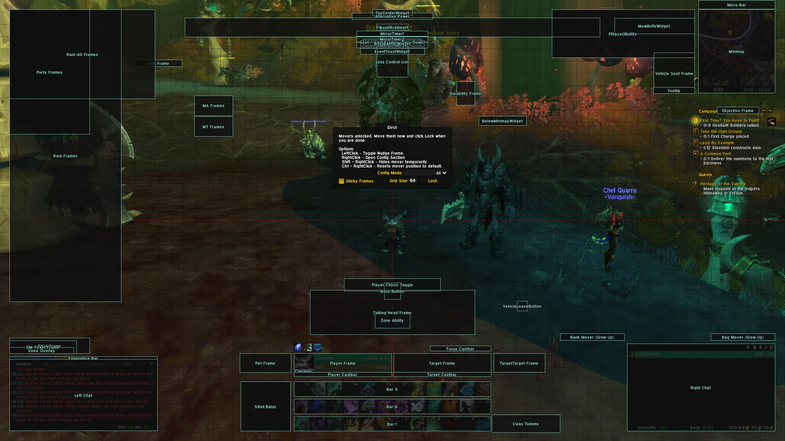

# Vivify

In early 2021, I stopped playing World of Warcraft nearly as much as I originally did due to _reasons_. And now, early 2022, I've come back to the game and probably spent about 20% of my in-game time re-designing, tweaking, fixing, sharing, and testing and updated version of my UI.

I like the new version it feels a lot cleaner, a lot more thought out, has a lot more general visibility, and should be an all-in-one kind of solution for people. It's definitely not for those into hardcore raiding or pushing 20+ Mythic keys, but it definitely does the job.

I'm totally open to suggestions, thoughts, and bug fixes, so if you do have any issues then, by all means, open a pull request with any tweaks or create an issue with enough information for me to resolve any issues you might have.

_Also, as a note, I've very lazily called the UI profile **Vivify** as I've found monk one of the most enjoyable classes that I've played in a long time recently, and it just seemed mildly appropriate (in a low-effort kinda way)._

## Required add-ons

Unfortunately, there are some required add-ons to use this UI as I've made a couple of complex tweaks:

- [ElvUI](https://www.tukui.org/download.php?ui=elvui)
- [ElvUI_TinkerToolbox](https://www.curseforge.com/wow/addons/elvui-tinkertoolbox)
- [AddOnSkins](https://www.curseforge.com/wow/addons/addonskins)

I'd highly recommend using the TukUI client to keep your ElvUI add-on up-to-date, and the other two are available on Curseforge, so there's a variety of ways of keeping them updated.

## Works well with

As well as the required add-ons, the UI also works nicely with the following:

|Add-on|Description|
|------|-----------|
|[Details!](https://www.curseforge.com/wow/addons/details)|Damage meters that look great in the lower-right panel|
|[Deadly Boss Mods](https://www.curseforge.com/wow/addons/deadly-boss-mods)|Totally customisable and has AddOnSkins options|

## Installation

To install Vivify, you need to import each file in the `src` directory by:

1. Open the ElvUI settings in-game
2. Click the "Profiles" button in the left-hand menu
3. Click the "Import Profile" button at the top
4. Paste each file's code into the text box and click "Import Now"

When doing the 4th setp, it's important to ensure that the "Importing:" text that appears shows you the correct item. You can verify this here:

|File|Should import as|
|----|----------------|
|`profile.lua`|**Profile**|
|`private.lua`|**Private (Character Settings)**|
|`global.lua`|**Global (Account Settings)**|
|`filters.lua`|**Aura Filters**|
|`styleFilters.lua`|**NamePlate Style Filters**|

When each file is imported, you should be able to choose both the "Public" and "Private" tabs, and choose "Vivify" from the "Existing Profiles" dropdown.

Typically, after such a large change, it's very good practice to use the `/reload` command to ensure that everything is loaded as intended. This should be all you need to do in order to activate Vivify and use it as your UI.

### Add-on: Details

To have Details! work with 100% compatibility with Vivify, you'll also need to open the Details! options window, and import the profile which can be found in [`src/addons/details.txt`](src/addons/details.txt).

## Screenshots

**Note:** You'll have to excuse the screenshots... I've not set this profile up on any level-capped toons yet as I've been levelling a monk, which has also been my go-to testing toon.

All of my screenshots are at 2560x1440 so this is how the profile should scale. Though you can always change the UI scale in ElvUI's general settings if it's a bit too large or small for your liking.

### General

### In combat

### General UI frames

### Group frames

### Boss bars

### Anchors

## FAQs

#### Does Vivify work with Classic and TBC?

From what I can tell, ElvUI _should_ have full backwards compatibility with Classic and TBC. I **did have some issues** with custom tags from my old profile, though I've not tried Vivify yet. I probably will do at some point but it's important to note that I cannot guarantee the required add-ons will work as intended. If they don't work, they don't work.

#### I've got a problem, can you help?

Absolutely, go [create an issue]() and let me know what's up so I can try my best to offer you a solution. Remember to keep the issue relevant though, I didn't create ElvUI or do _much_ custom coding here, so this should just be about any issues with the profile itself.

#### I've tweaked some settings that work way better and think they should be included, can I submit my ideas?

Absolutely: [create a pull request]() and make sure you provide:

- Notes as to what's changed
- Why you think this is an improvement
- Screenshots of this working
- Any other notes required to ensure this works

Should I agree with you or think the change should be implemented, then I'll merge it in and update the repository accordingly.

#### Can I create my own version of Vivify?

I'm more than happy for anyone who _generally_ agrees with the ideas and design here, but wants to execute it in their own way, to fork the repository and create their own version. Or, just use it in-game and apply and tweaks you need.

Just remember to make a back-up after making your changes.

## After-thoughts

It's worth noting that I am not the most hardcore WoW player in existence. I don't have tons of experiences with M+ dungeon-running or raiding, but I do enjoy playing the game with friends, or just people in general.

That being said, I'm open to _constructive_ criticism of Vivify, but I'd suggest you re-consider various aspects of your life if you're only opening issues to complain without any target goal.

I had fun building the profile and I intend to do so. If you don't agree with my decisions or the wy things are laid out, that's up to you, there are plenty of other options in the world.
